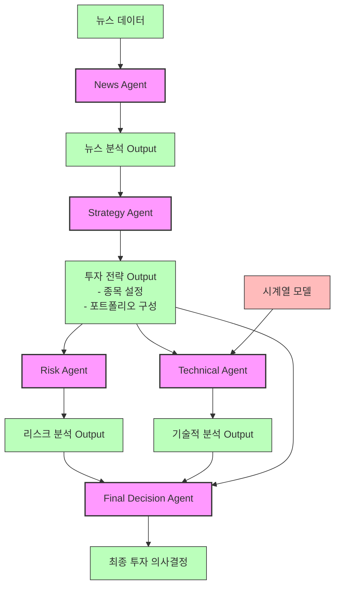

```mermaid
flowchart TD
    A[뉴스 데이터] --> B[News Agent]
    B --> C[뉴스 분석 Output]
    C --> D[Strategy Agent]
    D --> E[투자 전략 Output\n- 종목 설정\n- 포트폴리오 구성]
    
    E --> F[Risk Agent]
    F --> G[리스크 분석 Output]
    
    E --> H[Technical Agent]
    I[시계열 모델] --> H
    H --> J[기술적 분석 Output]
    
    G --> K[Final Decision Agent]
    J --> K
    E --> K
    
    K --> L[최종 투자 의사결정]
    
    classDef process fill:#f9f,stroke:#333,stroke-width:2px;
    classDef data fill:#bbf,stroke:#333,stroke-width:1px;
    classDef output fill:#bfb,stroke:#333,stroke-width:1px;
    classDef model fill:#fbb,stroke:#333,stroke-width:1px;
    
    class B,D,F,H,K process;
    class A,C,E,G,J,L output;
    class I model;
```